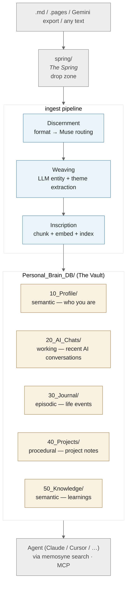

# Memosyne — Personal Memory Infrastructure

[繁體中文](README.zh.md)

> *Mnemosyne (Μνημοσύνη) — Titaness of Memory, mother of the Nine Muses.*
> *Those who drink from her spring remember everything; those who drink from Lethe forget all.*

Memosyne is a **local-first personal memory infrastructure** that gives AI agents (Claude, Cursor, etc.) access to your personal context — journals, conversations, profiles — organized and retrieved using cognitive science principles.

Built for the AI agent era: your memories become a queryable skill via MCP.

---

## 30-second start

```bash
git clone https://github.com/pppeterlin/Memosyne && cd Memosyne
pip install -e .
memosyne quickstart           # detects your LLM provider, runs end-to-end demo
```

`quickstart` builds the sample vault, runs a golden eval, and shows two example searches — all offline, no private data involved. Pick whichever LLM backend you have (local Ollama, DeepSeek API, OpenRouter, …) and `memosyne providers list` shows what's ready.

Then point Memosyne at your own life:

```bash
cp my_journal.md spring/
memosyne ingest               # routes the file, enriches it, indexes it
memosyne search "what was I thinking about last March?" --walk deep
```

For Claude Desktop / Cursor MCP integration, jump to [MCP Integration](#mcp-integration-claude-desktop--cursor).

---

## Core Premise

AI capabilities compound every quarter, but no model — however powerful — can know *you* from a cold start. The texture of your life (who you've spent time with, what you've decided, how you've changed) lives scattered across journals, chats, and notes.

**Start building your personal memory now, before the agent era fully arrives.** A vault built today is portable to every model that comes next, and the agents of tomorrow can plug into it to make decisions that are actually *yours* — not generic.

---

## Why Memosyne?

Current AI tools have no persistent memory. RAG solutions designed for enterprise knowledge bases miss what makes *personal* memory unique:

| Challenge | Personal Memory Specifics |
|-----------|--------------------------|
| Sparse semantics | "Went to the lake today" — location is key, but low embedding density |
| Entity cross-linking | "Grandma's House" → needs to find "Summer Vacation" via graph traversal |
| Temporal relevance | Last week's thoughts matter more than three years ago |
| Out-of-context chunks | A paragraph divorced from its document loses meaning |

Memosyne addresses all four with a bio-inspired retrieval stack.

---

## Architecture



The pipeline preserves human-readable Markdown at every stage — you can `cat` any file in `Personal_Brain_DB/` and read it. The vector index, BM25, and Tapestry graph are derived; the source of truth is always the `.md` itself.

---

## Retrieval Stack

```
Query
  ├─ Dense Vector  (ChromaDB · MiniLM-L12 · cosine)
  │   └─ Contextual Retrieval — The Illumination
  │       Each chunk prefixed with a global context summary
  │       to prevent out-of-context embedding
  │
  ├─ BM25 Keyword  (rank-bm25 · CJK bigram tokenizer)
  │
  ├─ Tapestry Graph  (Kuzu · Cypher · 1–2 hop traversal)
  │   Entities: Memory, Person, Location, Event, Period
  │   Solves cross-entity gaps ("city X → project Y → person Z")
  │
  └─ PPR Spreading Activation  (Personalized PageRank)
      Uses top search results as seeds, diffuses through
      the Tapestry graph to surface hidden related memories
        ↓
   RRF — Reciprocal Rank Fusion  (k=60, N-way merge)
        ↓
   ACT-R Cognitive Reranking — The Chronicle of Mneme
   A_i = ln(Σ t_k^{-d})   d=0.5
   Recent + frequently accessed memories rank higher
```

---

## Cognitive Features

### The Illumination — Contextual Retrieval

Before embedding, each paragraph chunk is prepended with a one-sentence global context note generated by a local LLM. This solves the classic RAG problem where isolated chunks lose their document-level meaning.

```bash
# Generate context notes (run once, then cached)
python3 Personal_Brain_DB/00_System/vectorize.py --contextualize

# Rebuild index with context notes applied
python3 Personal_Brain_DB/00_System/vectorize.py --rebuild
```

Notes are cached in `contextual_cache.json` — LLM is never called twice for the same chunk.

### The Chronicle of Mneme — ACT-R Reranking

Every search and file read is logged. The append-only source log is `chronicle.jsonl`; `chronicle.db` is a derived SQLite cache used for fast ACT-R scoring. Results are reranked using the ACT-R base-level activation formula:

```
A_i = ln( Σ_{k=1}^{n} t_k^{-0.5} )
```

Where *n* is access count and *t_k* is hours since the *k*-th access. Memories you interact with frequently and recently float to the top naturally.

```bash
python3 Personal_Brain_DB/00_System/mneme_weight.py --stats
python3 Personal_Brain_DB/00_System/mneme_weight.py --top 10
python3 Personal_Brain_DB/00_System/mneme_weight.py --export-jsonl --replace-jsonl
python3 Personal_Brain_DB/00_System/mneme_weight.py --rebuild-db-from-jsonl
```

### The Tapestry — Knowledge Graph

A persistent entity graph (Kuzu embedded graph DB) that enables multi-hop retrieval across entities. Solves the problem where "Grandma's House" and "Summer Vacation" live in different memories with no shared keyword.

```bash
python3 Personal_Brain_DB/00_System/tapestry.py --stats
python3 Personal_Brain_DB/00_System/tapestry.py --search "Tokyo,project-name"
python3 Personal_Brain_DB/00_System/tapestry.py --ppr "30_Journal/2025/note.md"
```

### The Rite of Slumber — Memory Consolidation

A periodic consolidation pass with three rites:

| Rite | What it does |
|------|-------------|
| **Reflection** | LLM distills recent memories into high-level insights → `10_Profile/reflections/` |
| **Hebbian Learning** | Memories co-recalled together gain `co_recalled` graph edges (*fire together, wire together*) |
| **The Lethe Protocol** | Low-importance, long-unused memories are marked `dormant` — excluded from search but never deleted |

```bash
python3 Personal_Brain_DB/00_System/slumber.py           # full consolidation
python3 Personal_Brain_DB/00_System/slumber.py --reflect
python3 Personal_Brain_DB/00_System/slumber.py --forget --dry-run
```

---

## Quick Start

### Requirements

- Python 3.10+
- One LLM backend (any one of these works — `memosyne providers list` shows status):
  - **Local Ollama** (private, free): `brew install ollama && ollama pull gemma3:4b`
  - **DeepSeek API** (cheap cloud, frontier reasoning): `DEEPSEEK_API_KEY` in `.env`
  - **OpenRouter** (multi-provider routing): drop key into `./openrouter-key`
  - **OpenAI-compatible proxy** (LiteLLM, aiclient-2-api, …): `PROXY_BASE_URL` + `PROXY_API_KEY`

Cloud LLM access is opt-in; full privacy model in [docs/privacy.md](docs/privacy.md).

```bash
git clone https://github.com/pppeterlin/Memosyne && cd Memosyne
python -m venv .venv && source .venv/bin/activate
pip install -e .
memosyne health         # confirm every artifact + backend is reachable
memosyne quickstart     # demo against the public sample vault
```

### Ingest your first memory

```bash
cp my_journal.md spring/             # drop file into The Spring
memosyne ingest                      # routes, enriches, indexes

# Options
memosyne ingest --dry-run            # preview only
memosyne ingest --no-enrich          # skip LLM enrichment (faster)
memosyne rebuild --full              # full index rebuild (only when schema changed)
```

### Search your memories

```bash
# v0.3 command surface
python3 memosyne.py health
python3 memosyne.py search "happiest days in 2025" --top 5

# Interactive search REPL
python3 Personal_Brain_DB/00_System/search.py

# One-shot query
python3 Personal_Brain_DB/00_System/vectorize.py --query "happiest days in 2025" --top 5

# RAG chat (uses your configured LLM backend)
python3 Personal_Brain_DB/00_System/chat.py
```

---

## MCP Integration (Claude Desktop / Cursor)

Add to your MCP config (`~/.claude/claude_desktop_config.json` or equivalent):

```json
{
  "mcpServers": {
    "personal-brain": {
      "command": "/path/to/your/venv/bin/python",
      "args": [
        "/path/to/memosyne/Personal_Brain_DB/00_System/mcp_server.py"
      ]
    }
  }
}
```

**Available MCP tools:**

| Tool | Description |
|------|-------------|
| `search_memory(query, top_k)` | Hybrid search + ACT-R reranking |
| `get_profile(section)` | Read profile files (bio, career, etc.) |
| `list_journals(year, limit)` | Browse journal entries |
| `read_file(path)` | Read any memory file (sandboxed) |
| `optimize_memory(action)` | Trigger memory consolidation (`reflect`/`hebbian`/`forget`/`all`) |
| `get_memory_health()` | Chronicle access stats and ACT-R report |

---

## Scripts Reference

| Script | Purpose | Key flags |
|--------|---------|-----------|
| `ingest.py` | Format detection, routing, one-shot ingestion | `--dry-run` `--no-enrich` `--rebuild` |
| `enrich.py` | LLM semantic enrichment (Oracle of Mneme) | `--rebuild` `--model` `--file` |
| `vectorize.py` | Vector + BM25 indexing | `--rebuild` `--contextualize` `--query` |
| `tapestry.py` | Knowledge graph management | `--backfill` `--stats` `--search` `--ppr` |
| `mcp_server.py` | MCP server | — |
| `search.py` | Interactive search REPL | — |
| `chat.py` | RAG chat (configurable local or cloud backend) | — |
| `augury.py` | Memory quality audit and correction | `--inspect` `--correct` `--patrol` |
| `mneme_weight.py` | ACT-R access log and cognitive decay | `--stats` `--top` `--score` |
| `slumber.py` | Memory consolidation | `--reflect` `--hebbian` `--forget` `--stats` |
| `watch.py` | Filesystem watcher daemon | — |

### v0.3 Command Surface

The v0.3 CLI is a thin wrapper over the existing scripts:

```bash
python3 memosyne.py init
python3 memosyne.py ingest
python3 memosyne.py search "sample query"
python3 memosyne.py rebuild
python3 memosyne.py health
python3 memosyne.py mcp --check
python3 memosyne.py slumber --stats
python3 memosyne.py chronicle --stats
```

After editable install, the same commands are available as `memosyne ...`:

```bash
pip install -e .
memosyne health
```

Daily operations and troubleshooting are documented in [docs/operations.md](docs/operations.md).
Configuration is documented in [docs/configuration.md](docs/configuration.md), MCP setup in [docs/mcp.md](docs/mcp.md), correction flow in [docs/correction.md](docs/correction.md), and evaluation in [docs/evaluation.md](docs/evaluation.md).

---

## Memory Schema

Each memory is a Markdown file with YAML frontmatter in two layers:

**Base layer** (auto-generated by `ingest.py`):
```yaml
---
uuid: "7fe3db7eeb54"
title: "Journal 2025-12-02"
date_created: "2025-12-02"
type: "note"           # note | chat | bio | project
source: "pages"        # pages | gemini | manual
tags: ["travel", "reflection"]
summary: "Arrived at the lake town, felt immediately at peace..."
---
```

**Enrichment layer** (auto-appended by `enrich.py`, ground-truth preserving):
```yaml
# ── Enrichment ──
enriched_at: "2026-04-11T12:00:00"
importance: high       # low | medium | high
period: "2025 lake town residency"
themes: ["travel", "self-healing", "nature"]
personal_facts:
  - "spent 3 months living near the lake"
entities:
  locations: ["Erhai Lake", "Cangshan"]
  people: ["Yi Le"]
  events: ["residency trip"]
  emotions: ["healed", "peaceful"]
```

**Design principle — Ground-Truth Preserving:** The Oracle only records entities that appear *literally* in the source text. Every extraction is string-validated against the original. No inference, no hallucination.

---

## Tech Stack

| Layer | Technology |
|-------|-----------|
| Vector DB | ChromaDB (cosine · HNSW) |
| Embedding | paraphrase-multilingual-MiniLM-L12-v2 (384-dim) |
| Graph DB | Kuzu (embedded · Cypher) |
| Keyword index | rank-bm25 (CJK bigram tokenizer) |
| PPR | NetworkX pagerank |
| LLM backend | Pluggable — any local LLM runtime (Ollama, llama.cpp, LM Studio, vLLM, …) or opt-in cloud provider |
| MCP framework | FastMCP |
| Cognitive reranking | ACT-R (custom impl · SQLite) |

---

## Repository Structure

```
memosyne/
├── Personal_Brain_DB/
│   ├── 00_System/      ← all scripts, indices, databases
│   ├── 10_Profile/     ← your profile (gitignored)
│   ├── 20_AI_Chats/    ← AI conversation exports (gitignored)
│   ├── 30_Journal/     ← journals and notes (gitignored)
│   ├── 40_Projects/    ← project notes (gitignored)
│   └── 50_Knowledge/   ← knowledge files (gitignored)
├── spring/             ← drop zone for new memories
├── CLAUDE.md           ← project conventions (for Claude Code)
└── README.md
```

All personal memory content (folders 10–50) is excluded from git via `.gitignore`.

---

## Glossary — mythology ↔ engineering

The codebase uses Greek-mythology naming to give each subsystem a human voice. If you're reading source and want the engineering meaning:

| Mythological name | Engineering meaning |
|---|---|
| **Mnemosyne** | The titaness of memory; project namesake |
| **The Spring** (`spring/`) | Drop zone where raw files arrive before ingest |
| **The Vault** (`Personal_Brain_DB/`) | Canonical Markdown storage; source of truth |
| **The Nine Muses** | File-type routers (Clio = journal, Calliope = AI chats, …) |
| **Oracle of Mneme** (`enrich.py`) | LLM-based entity + theme extractor |
| **The Tapestry** (`tapestry.py` / `tapestry.json`) | Knowledge graph: memories ↔ people / places / events |
| **The Chronicle of Mneme** (`mneme_weight.py`) | Access log + ACT-R cognitive decay rerank |
| **The Illumination** | Contextual Retrieval — paragraph summaries injected before embedding |
| **The Triple Echo** | HyQE — hypothetical questions per chunk for multi-view retrieval |
| **The Augury** / **Augury Replay** | Retrieval evaluation (golden eval + real-query replay) |
| **Aletheia** | Correction layer: edit / invalidate / revert facts with full audit |
| **The Rite of Slumber** | Memory consolidation: reflect (insights) + Hebbian (edge boost) + Lethe (dormant marker) |
| **The Lethe Protocol** | Strategic forgetting — mark long-dormant memories without deleting |
| **The Open Threshold** | MCP HTTP transport with bearer-token auth |
| **The Self-Weaving Tapestry** | v0.5 deterministic link extraction (frontmatter + body shorthand → graph edges) |
| **The Codex of Skills** | `00_System/skills/` — fat skill docs for MCP-aware agents |

The mythology is a memory aid, not a barrier. Every command in the CLI uses the plain engineering verb (`ingest`, `search`, `rebuild`, …); the poetry lives in output strings and the docstrings.

---

## Roadmap

**Shipped (v0.1 – v0.6)**

- [x] Format-agnostic ingestion (`.pages`, `.md`, Gemini export, journal append)
- [x] Ground-truth-preserving LLM enrichment + deterministic link extractor
- [x] Hybrid search: Dense + BM25 + Graph → RRF + ACT-R rerank
- [x] Contextual Retrieval (Illumination) + HyQE (Triple Echo) + Parent-child chunking
- [x] PPR Spreading Activation + Two-pass walk (fast graph alternative)
- [x] Memory consolidation: Reflection + Hebbian + Lethe + Naming + Ordeal + Aggregation
- [x] MCP Server (stdio + HTTP with bearer-token auth)
- [x] Augury Replay — capture real queries → replay against current code → drift report
- [x] Per-prefix ACT-R decay + backlink boost
- [x] Aletheia correction layer with full audit + revert
- [x] **Turn-level dedup (v0.6)** — Gemini continuations / journal append no longer drop content silently
- [x] Bi-temporal Tapestry (valid_time vs. ingest_time)

**In progress (v0.7 — Open Threshold)**

- [x] `memosyne quickstart` + `providers list/test` for first-run experience
- [x] CLI consistency: `enrich` / `contextualize` / `hyqe` / `auth` as first-class subcommands
- [x] `rebuild` defaults to incremental (was always full-rebuild)
- [x] Release script (`make release VERSION=X.Y.Z`) with pre-flight gates
- [ ] Docs reorganization (getting-started / using / architecture splits)
- [ ] All error messages have actionable next-step hints

**Deferred to future releases**

- [ ] Partial enrichment merge (only-enrich-new-turns) — v0.8
- [ ] Aletheia turn-level correction
- [ ] OAuth 2.1 for MCP HTTP transport
- [ ] Slack / Discord / WhatsApp parsers (architecture supports; need fixtures)
- [ ] Installable Python package (`pip install memosyne`)

---

## Acknowledgements & References

Memosyne stands on the shoulders of excellent research and open-source work. The techniques below are cited in the architecture and in [優化方案_索引與保存管理.md](優化方案_索引與保存管理.md). Respect where it's due.

### Foundational techniques already implemented

- **ACT-R cognitive decay** — Anderson, J. R., et al. *An integrated theory of the mind.* Psychological Review (2004). The base-level activation formula `B_i = ln(Σ t_k^{-d})` powers The Chronicle of Mneme.
- **Contextual Retrieval** — Anthropic (2024). [Introducing Contextual Retrieval](https://www.anthropic.com/news/contextual-retrieval). Inspired The Illumination.
- **Reciprocal Rank Fusion (RRF)** — Cormack, G. V., Clarke, C. L. A., & Büttcher, S. *Reciprocal rank fusion outperforms Condorcet and individual rank learning methods.* SIGIR (2009).
- **BM25** — Robertson, S., & Zaragoza, H. *The Probabilistic Relevance Framework: BM25 and Beyond.* Foundations and Trends in IR (2009).
- **Personalized PageRank** — Haveliwala, T. H. *Topic-sensitive PageRank.* WWW (2002). Powers Tapestry spreading-activation retrieval.
- **HippoRAG** — Gutiérrez, B. J., et al. [*HippoRAG: Neurobiologically Inspired Long-Term Memory for LLMs.*](https://arxiv.org/abs/2405.14831) NeurIPS (2024).

### Research informing Retrieval v2

- **HippoRAG 2** — Gutiérrez, B. J., et al. [arxiv 2502.14802](https://arxiv.org/abs/2502.14802) (2025). Phrase+passage unified graph PPR.
- **Zep / Graphiti** — Rasmussen, P., et al. [*Zep: A Temporal Knowledge Graph Architecture for Agent Memory.*](https://arxiv.org/abs/2501.13956) (2025). Bi-temporal edges & edge invalidation. OSS: [getzep/graphiti](https://github.com/getzep/graphiti).
- **Mem0** — Chhikara, P., et al. [*Mem0: Building Production-Ready AI Agents with Scalable Long-Term Memory.*](https://arxiv.org/abs/2504.19413) (2025). CRUD memory ops + contradiction resolution.
- **A-MEM** — Xu, W., et al. [*A-MEM: Agentic Memory for LLM Agents.*](https://arxiv.org/abs/2502.12110) (2025). Zettelkasten-style memory evolution.
- **LightRAG** — Guo, Z., et al. [*LightRAG: Simple and Fast Retrieval-Augmented Generation.*](https://arxiv.org/abs/2410.05779) (2024). Incremental dual-level graph updates.
- **GraphRAG** — Edge, D., et al. [*From Local to Global: A Graph RAG Approach to Query-Focused Summarization.*](https://arxiv.org/abs/2404.16130) Microsoft Research (2024).
- **HyDE** — Gao, L., et al. [*Precise Zero-Shot Dense Retrieval without Relevance Labels.*](https://arxiv.org/abs/2212.10496) ACL (2023). Basis for The Triple Echo's HyQE view.
- **Self-RAG** — Asai, A., et al. [*Self-RAG: Learning to Retrieve, Generate, and Critique through Self-Reflection.*](https://arxiv.org/abs/2310.11511) ICLR (2024). Basis for The Mirror of Truth.
- **ColBERT / ColBERTv2** — Khattab, O., & Zaharia, M. [*ColBERT: Efficient and Effective Passage Search via Contextualized Late Interaction over BERT.*](https://arxiv.org/abs/2004.12832) SIGIR (2020).
- **MemGPT / Letta** — Packer, C., et al. [*MemGPT: Towards LLMs as Operating Systems.*](https://arxiv.org/abs/2310.08560) (2023).
- **LongMemEval** — Wu, D., et al. [*LongMemEval: Benchmarking Chat Assistants on Long-Term Interactive Memory.*](https://arxiv.org/abs/2410.10813) (2024). Methodology informing The Augury Benchmark.
- **RAGAS** — Es, S., et al. [*RAGAS: Automated Evaluation of Retrieval Augmented Generation.*](https://docs.ragas.io) EACL (2024).

### Tools & libraries

- [ChromaDB](https://www.trychroma.com/) — vector store
- [Kuzu](https://kuzudb.com/) — embedded graph database
- [NetworkX](https://networkx.org/) — in-memory graph algorithms & PageRank
- [rank-bm25](https://github.com/dorianbrown/rank_bm25) — BM25 implementation
- [sentence-transformers](https://www.sbert.net/) — multilingual embedding (`paraphrase-multilingual-MiniLM-L12-v2`)
- [FastMCP](https://github.com/jlowin/fastmcp) — MCP server framework
- [Ollama](https://ollama.com/) — local LLM runtime

If a technique informs Memosyne and is not credited here, please open an issue — citations are load-bearing, not decorative.

---

*Built with a mythological worldview — because memory deserves ceremony.*
