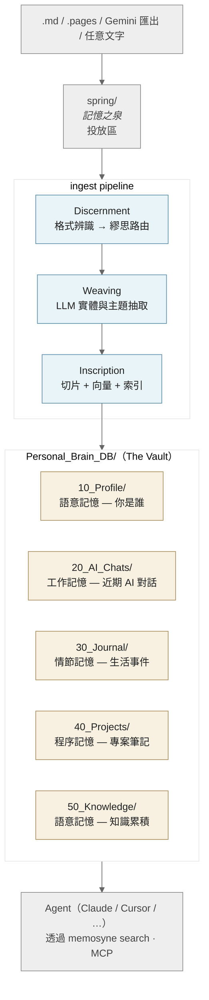

# Memosyne — 個人記憶基礎設施

[English](README.md)

> *Mnemosyne（Μνημοσύνη）— 泰坦神記憶女神，九位繆思女神之母。*
> *飲此泉水者，靈魂記憶永不遺失；飲忘川之水者，遺忘一切。*

Memosyne 是一個本地優先的個人記憶基礎設施，透過 MCP 協議讓 AI Agent（Claude、Cursor 等）能夠存取你的個人脈絡——日記、對話紀錄、Profile 等——並以認知科學的方式組織和檢索。

---

## 30 秒上手

```bash
git clone https://github.com/pppeterlin/Memosyne && cd Memosyne
pip install -e .
memosyne quickstart           # 偵測 LLM provider，跑完整端到端 demo
```

`quickstart` 會建好 sample vault 索引、跑 golden eval、展示兩個搜尋範例——**完全離線、不碰任何私人資料**。任何一個 LLM backend 都能用（本地 Ollama、DeepSeek API、OpenRouter…），`memosyne providers list` 看哪個就緒。

接著把自己的人生餵進來：

```bash
cp my_journal.md spring/
memosyne ingest               # 自動路由、增強、索引
memosyne search "去年三月我在想什麼？" --walk deep
```

Claude Desktop / Cursor 的 MCP 整合請看 [MCP 設定](#mcp-設定claude-desktop--cursor) 段。

---

## 核心精神

AI 能力每季都在跳躍，但再強的模型也無法在冷啟動狀態下認識「你」——你和誰共度時光、做過哪些決定、如何一路改變——這些只散落在日記、對話與筆記裡。

**現在就該開始累積個人記憶庫，趕在 agent 時代全面到來之前。** 今天建立的記憶可以接到未來任何模型上，讓 agent 做出真正屬於你的決策，而非通用建議。

---

## 架構總覽



整個 pipeline 每個階段都保留人類可讀的 Markdown——`Personal_Brain_DB/` 裡任何檔案都能 `cat` 讀。向量索引、BM25、Tapestry 圖譜都是衍生物；**唯一的真相是 `.md` 本身**。

---

## 搜尋架構

```
查詢
  ├─ Dense Vector（ChromaDB, MiniLM-L12, cosine）
  │   + Contextual Retrieval（The Illumination）
  │     每個 chunk 附加全局語境摘要，改善斷章取義問題
  ├─ BM25 關鍵字（CJK bigram tokenizer）
  ├─ Tapestry Graph（Kuzu 圖譜，實體關聯跳轉）
  └─ PPR Spreading Activation（Personalized PageRank）
       以搜尋結果為 seed，發現隱藏關聯記憶
         ↓
   RRF（Reciprocal Rank Fusion）融合
         ↓
   ACT-R 認知衰減重排（The Chronicle of Mneme）
   A_i = ln(Σ t_k^{-0.5})  — 近期且高頻的記憶優先
```

---

## 快速開始

### 環境需求

- Python 3.10+
- 任一個 LLM backend（`memosyne providers list` 看狀態）：
  - **本地 Ollama**（私密、免費）：`brew install ollama && ollama pull gemma3:4b`
  - **DeepSeek API**（便宜的 frontier 推理）：在 `.env` 設 `DEEPSEEK_API_KEY`
  - **OpenRouter**（多 provider 路由）：把 key 寫進 `./openrouter-key`
  - **OpenAI 相容 proxy**（LiteLLM / aiclient-2-api）：設 `PROXY_BASE_URL` + `PROXY_API_KEY`

雲端 LLM 是 opt-in；完整隱私模型見 [docs/privacy.md](docs/privacy.md)。

```bash
git clone https://github.com/pppeterlin/Memosyne && cd Memosyne
python -m venv .venv && source .venv/bin/activate
pip install -e .
memosyne health         # 確認所有 artifact 與 backend 都可達
memosyne quickstart     # 對 sample vault 跑端到端 demo
```

### 入庫新記憶

```bash
cp 我的日記.md spring/                # 投放到記憶之泉
memosyne ingest                       # 自動路由、增強、索引

# 選項
memosyne ingest --dry-run             # 預覽
memosyne ingest --no-enrich           # 跳過 LLM 增強（更快）
memosyne rebuild --full               # 完整重建索引（只在 schema 變動時用）
```

### 搜尋記憶

```bash
memosyne search "我去年三月在想什麼？" --top 5 --walk deep
memosyne search "Tokyo trip" --return-parent     # 展開完整段落
memosyne search "AI 創業" --walk fast            # 用快版 graph walk

# 互動 / 進階
python3 Personal_Brain_DB/00_System/search.py     # 互動式 REPL
python3 Personal_Brain_DB/00_System/chat.py       # RAG 對話
```

---

## 腳本說明

| 腳本 | 功能 | 主要選項 |
|------|------|---------|
| `ingest.py` | 格式偵測、路由、一鍵入庫 | `--dry-run`, `--no-enrich`, `--rebuild` |
| `enrich.py` | LLM 語意增強（Oracle of Mneme） | `--rebuild`, `--model`, `--file` |
| `vectorize.py` | 向量化 + BM25 索引 | `--rebuild`, `--contextualize`, `--query` |
| `tapestry.py` | 知識圖譜管理 | `--backfill`, `--stats`, `--search`, `--ppr` |
| `mcp_server.py` | MCP 伺服器（對外接口） | — |
| `search.py` | 互動式搜尋 REPL | — |
| `chat.py` | RAG 對話（可設定本地或雲端後端） | — |
| `augury.py` | 記憶品質審計與修正 | `--inspect`, `--correct`, `--patrol` |
| `mneme_weight.py` | ACT-R 存取紀錄與認知衰減 | `--stats`, `--top`, `--score` |
| `slumber.py` | 記憶鞏固（The Rite of Slumber） | `--reflect`, `--hebbian`, `--forget`, `--stats` |
| `watch.py` | 檔案系統監控守夜 | — |

### v0.3 Command Surface

v0.3 CLI 先作為既有腳本的薄包裝：

```bash
python3 memosyne.py init
python3 memosyne.py ingest
python3 memosyne.py search "測試查詢"
python3 memosyne.py rebuild
python3 memosyne.py health
python3 memosyne.py mcp --check
python3 memosyne.py slumber --stats
python3 memosyne.py chronicle --stats
```

若使用 editable install，則可直接執行：

```bash
pip install -e .
memosyne health
```

日常操作與 troubleshooting 見 [docs/operations.md](docs/operations.md)。
設定說明見 [docs/configuration.md](docs/configuration.md)，MCP 設定見 [docs/mcp.md](docs/mcp.md)，修正流程見 [docs/correction.md](docs/correction.md)，評估流程見 [docs/evaluation.md](docs/evaluation.md)。

---

## MCP 設定（Claude Desktop / Cursor）

```json
{
  "mcpServers": {
    "personal-brain": {
      "command": "/path/to/your/venv/bin/python",
      "args": [
        "/path/to/memosyne/Personal_Brain_DB/00_System/mcp_server.py"
      ]
    }
  }
}
```

**MCP 工具：**
- `search_memory(query, top_k)` — 混合搜尋 + ACT-R 重排
- `get_profile(section)` — 讀取 Profile
- `list_journals(year, limit)` — 瀏覽日記清單
- `read_file(path)` — 讀取任意記憶檔案
- `optimize_memory(action)` — 觸發記憶鞏固（reflect/hebbian/forget/all）
- `get_memory_health()` — Chronicle 健康報告

---

## 認知功能

### Contextual Retrieval — The Illumination

解決切片斷章取義問題。為每個段落生成「全局語境摘要」，讓 embedding 捕捉到段落在整篇文件中的角色。

```bash
python3 Personal_Brain_DB/00_System/vectorize.py --contextualize
python3 Personal_Brain_DB/00_System/vectorize.py --rebuild
```

快取在 `contextual_cache.json`，不重複呼叫 LLM。

### ACT-R 認知衰減 — The Chronicle of Mneme

基於認知科學的記憶重排：近期且頻繁使用的記憶排名更高。
`chronicle.jsonl` 是 append-only 真相來源，`chronicle.db` 是可由 JSONL 重建的 SQLite 查詢快取。

```
A_i = ln(Σ_{k=1}^{n} t_k^{-0.5})
```

```bash
python3 Personal_Brain_DB/00_System/mneme_weight.py --stats
python3 Personal_Brain_DB/00_System/mneme_weight.py --top 10
python3 Personal_Brain_DB/00_System/mneme_weight.py --export-jsonl --replace-jsonl
python3 Personal_Brain_DB/00_System/mneme_weight.py --rebuild-db-from-jsonl
```

### Tapestry — 知識圖譜

實體關聯圖（Kuzu 圖資料庫），解決跨實體斷鏈問題（例如：「外婆家」→「暑假回憶」）。

```bash
python3 Personal_Brain_DB/00_System/tapestry.py --stats
python3 Personal_Brain_DB/00_System/tapestry.py --search "外婆家,暑假回憶"
python3 Personal_Brain_DB/00_System/tapestry.py --ppr "30_Journal/2025/250604.md"
```

### The Rite of Slumber — 記憶鞏固

| 子儀式 | 功能 |
|--------|------|
| **Reflection** | LLM 從近期記憶提煉洞察 → `10_Profile/reflections/` |
| **Hebbian Learning** | 共同被搜尋的記憶加強 `co_recalled` 邊 |
| **The Lethe Protocol** | importance=low 且長期未用的記憶標記 `dormant` |

```bash
python3 Personal_Brain_DB/00_System/slumber.py          # 完整鞏固
python3 Personal_Brain_DB/00_System/slumber.py --reflect
python3 Personal_Brain_DB/00_System/slumber.py --forget --dry-run
```

---

## 技術棧

| 層 | 技術 |
|----|------|
| 向量 DB | ChromaDB (cosine, HNSW) |
| Embedding | paraphrase-multilingual-MiniLM-L12-v2 (384-dim) |
| 圖資料庫 | Kuzu (Cypher, 嵌入式) |
| 關鍵字索引 | rank-bm25 (CJK bigram) |
| PPR | NetworkX pagerank |
| LLM 後端 | 可插拔——任一本地 LLM runtime（Ollama、llama.cpp、LM Studio、vLLM 等），或可選的雲端 provider |
| MCP 框架 | FastMCP |
| 認知重排 | ACT-R (自實作, SQLite chronicle) |

---

## 目錄結構

```
memosyne/
├── Personal_Brain_DB/
│   ├── 00_System/          ← 所有腳本、索引、資料庫
│   ├── 10_Profile/         ← 個人 Profile（不進 git）
│   ├── 20_AI_Chats/        ← AI 對話紀錄（不進 git）
│   ├── 30_Journal/         ← 日記手札（不進 git）
│   ├── 40_Projects/        ← 專案筆記（不進 git）
│   └── 50_Knowledge/       ← 知識文件（不進 git）
├── spring/                 ← 記憶之泉（drop zone）
├── _internal/              ← 開發文檔（不進 git）
├── CLAUDE.md               ← 專案開發規範
└── README.md
```

*所有個人記憶內容（10~50 資料夾）均在 `.gitignore` 中排除。*

---

## 詞彙對照 — 神話 ↔ 工程

Codebase 用希臘神話命名讓每個子系統有人性的聲音。讀原始碼想看工程意義時：

| 神話名稱 | 工程意義 |
|---|---|
| **Mnemosyne** | 記憶女神泰坦；專案名稱由來 |
| **The Spring**（`spring/`）| 投放區，新檔案進入 ingest 前的入口 |
| **The Vault**（`Personal_Brain_DB/`）| 規範性 Markdown 儲存；唯一真相 |
| **The Nine Muses** | 檔案類型路由器（Clio=日記、Calliope=AI 對話…）|
| **Oracle of Mneme**（`enrich.py`）| LLM-based 實體與主題抽取器 |
| **The Tapestry**（`tapestry.py`）| 知識圖譜：記憶 ↔ 人/地/事件 |
| **The Chronicle of Mneme**（`mneme_weight.py`）| 存取日誌 + ACT-R 認知衰減重排 |
| **The Illumination** | Contextual Retrieval — 段落摘要注入後再 embedding |
| **The Triple Echo** | HyQE — 每 chunk 生成假設問題做多 view 檢索 |
| **The Augury / Augury Replay** | 檢索評估（golden eval + 真實 query replay）|
| **Aletheia** | 修正層：編輯/失效/還原事實，完整 audit |
| **The Rite of Slumber** | 記憶鞏固：反思 + Hebbian + Lethe + Naming + Ordeal + Aggregation |
| **The Lethe Protocol** | 策略性遺忘 — 標記沉睡記憶但不刪除 |
| **The Open Threshold** | MCP HTTP 傳輸 + bearer token 認證 |
| **The Self-Weaving Tapestry** | v0.5 deterministic link 抽取（frontmatter + body → 圖譜邊）|
| **The Codex of Skills** | `00_System/skills/` — 給 MCP-aware agent 的 fat skill 文件 |

神話只是記憶輔助，不是門檻。所有 CLI 指令都用平實工程動詞（`ingest`、`search`、`rebuild`…）；詩意保留在輸出訊息與 docstring。

---

## 路線圖

**已出貨（v0.1 – v0.6）**

- [x] 格式無關的入庫流程（`.pages`、`.md`、Gemini 匯出、journal 追寫）
- [x] Ground-truth-preserving LLM 增強 + deterministic link extractor
- [x] 混合檢索：Dense + BM25 + Graph → RRF + ACT-R 重排
- [x] Contextual Retrieval（Illumination）+ HyQE（Triple Echo）+ Parent-child 切片
- [x] PPR Spreading Activation + Two-pass walk（快速圖譜走訪）
- [x] 記憶鞏固：Reflection + Hebbian + Lethe + Naming + Ordeal + Aggregation
- [x] MCP Server（stdio + HTTP 含 bearer token 認證）
- [x] Augury Replay — 擷取真實查詢 → 重播比對現行 code → drift 報告
- [x] Per-prefix ACT-R decay + backlink boost
- [x] Aletheia 修正層含完整 audit + revert
- [x] **Turn-level 去重（v0.6）** — Gemini 續寫 / journal 追寫不再靜默丟資料
- [x] Bi-temporal Tapestry（valid_time vs. ingest_time）

**進行中（v0.7 — The Open Threshold）**

- [x] `memosyne quickstart` + `providers list/test` 首次體驗
- [x] CLI 一致性：`enrich` / `contextualize` / `hyqe` / `auth` 成為一級 subcommand
- [x] `rebuild` 預設增量（過去永遠 full rebuild）
- [x] Release 腳本（`make release VERSION=X.Y.Z`）含 pre-flight 守門
- [ ] Docs 重組（getting-started / using / architecture 三層分組）
- [ ] 所有錯誤訊息都有可執行的 next-step 提示

**延後到未來版本**

- [ ] Partial enrichment merge（只 enrich 新 turns）— v0.8
- [ ] Aletheia turn-level correction
- [ ] OAuth 2.1 給 MCP HTTP transport
- [ ] Slack / Discord / WhatsApp parser（架構已支援，需 fixture）
- [ ] 可安裝 PyPI 套件（`pip install memosyne`）

---

## 致謝與參考文獻（Acknowledgements & References）

Memosyne 站在許多優秀研究與開源專案的肩膀上。以下是架構中採用的技術、以及 [優化方案_索引與保存管理.md](優化方案_索引與保存管理.md) 規劃的 v2 升級所依據的文獻。該有的致敬不能少。

### 已實作技術的基礎文獻

- **ACT-R 認知衰減** — Anderson, J. R. 等. *An integrated theory of the mind.* Psychological Review (2004)。基礎激活公式 `B_i = ln(Σ t_k^{-d})` 驅動 The Chronicle of Mneme。
- **Contextual Retrieval** — Anthropic (2024). [Introducing Contextual Retrieval](https://www.anthropic.com/news/contextual-retrieval)。啟發 The Illumination。
- **Reciprocal Rank Fusion (RRF)** — Cormack 等, SIGIR (2009)。
- **BM25** — Robertson & Zaragoza, Foundations and Trends in IR (2009)。
- **Personalized PageRank** — Haveliwala, WWW (2002)。Tapestry 擴散激發的核心演算法。
- **HippoRAG** — Gutiérrez 等. [*HippoRAG: Neurobiologically Inspired Long-Term Memory for LLMs.*](https://arxiv.org/abs/2405.14831) NeurIPS (2024)。

### Retrieval v2 參考研究

- **HippoRAG 2** — [arxiv 2502.14802](https://arxiv.org/abs/2502.14802) (2025)。短語+段落統一圖 PPR。
- **Zep / Graphiti** — [arxiv 2501.13956](https://arxiv.org/abs/2501.13956) (2025)。雙時序邊與邊失效機制。開源：[getzep/graphiti](https://github.com/getzep/graphiti)。
- **Mem0** — [arxiv 2504.19413](https://arxiv.org/abs/2504.19413) (2025)。CRUD 式記憶操作與衝突解決。
- **A-MEM** — [arxiv 2502.12110](https://arxiv.org/abs/2502.12110) (2025)。Zettelkasten 式記憶演化。
- **LightRAG** — [arxiv 2410.05779](https://arxiv.org/abs/2410.05779) (2024)。增量式雙層級圖更新。
- **GraphRAG** — [arxiv 2404.16130](https://arxiv.org/abs/2404.16130) Microsoft Research (2024)。
- **HyDE** — [arxiv 2212.10496](https://arxiv.org/abs/2212.10496) ACL (2023)。The Triple Echo 的 HyQE 視角依據。
- **Self-RAG** — [arxiv 2310.11511](https://arxiv.org/abs/2310.11511) ICLR (2024)。The Mirror of Truth 的依據。
- **ColBERT / ColBERTv2** — [arxiv 2004.12832](https://arxiv.org/abs/2004.12832) SIGIR (2020)。
- **MemGPT / Letta** — [arxiv 2310.08560](https://arxiv.org/abs/2310.08560) (2023)。
- **LongMemEval** — [arxiv 2410.10813](https://arxiv.org/abs/2410.10813) (2024)。The Augury Benchmark 的評估方法論。
- **RAGAS** — [docs.ragas.io](https://docs.ragas.io) EACL (2024)。

### 工具與函式庫

- [ChromaDB](https://www.trychroma.com/) · [Kuzu](https://kuzudb.com/) · [NetworkX](https://networkx.org/) · [rank-bm25](https://github.com/dorianbrown/rank_bm25) · [sentence-transformers](https://www.sbert.net/) · [FastMCP](https://github.com/jlowin/fastmcp) · [Ollama](https://ollama.com/)

若有未列出的引用來源，歡迎開 issue 補上 —— 引用不是裝飾，是該做的事。

---

*最後更新：2026-04-21*
